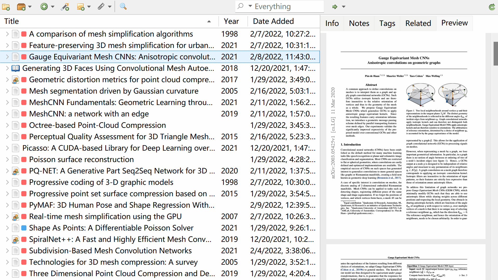

# Zotero PDF Preview



Preview PDF attachments in the library view.  

Fast & easy. Do not require any third-party softwares.

# Quick Start Guide

## Install

- Download the latest release (.xpi file) from the [Releases Page](https://github.com/windingwind/zotero-pdf-preview/releases)_Note_ If you're using Firefox as your browser, right-click the `.xpi` and select "Save As.."
- In Zotero click `Tools` in the top menu bar and then click `Addons`
- Go to the Extensions page and then click the gear icon in the top right.
- Select `Install Add-on from file`.
- Browse to where you downloaded the `.xpi` file and select it.
- Restart Zotero, by clicking `restart now` in the extensions list where the
  Zotero PDF Translate plugin is now listed.

## Settings

Find settings here: Menubar -> Edit -> Preferences -> Preview

| Setting | Details | Default Value |
| ---- | ---- | ---- |
| Enable Preview | Enable to allow the preview behavior. | `true` |
| Auto Focus Preview Tab | Enable to focus the preview tab automatically when you select a valid preview item. | `false` |
| Show Annotations | Enable to show annotations of the PDF files. May slow down the preview speed. | `false` |
| Dark Mode | Enable to preview PDF files in dark mode. This is a naive dark mode and images color may not be displayed correctly. | `false` |
| Preview First _N_ Pages | Set how many pages you want to appear in preview. More pages will make the preview slower. Set to `1` for the cover view. | `10` |
| Preview Tab Name | Set the tab label. | `preview` |

Menu -> View -> Auto Preview PDF(check/uncheck)

## Development & Contributing

This add-on is built on the Zotero Addon Template of [zotero-pdf-translate](https://github.com/windingwind/zotero-pdf-translate).

### Build

```shell
# A release-it command: version increase, npm run build, git push, and GitHub release
# You need to set the environment variable GITHUB_TOKEN https://github.com/settings/tokens
# release-it: https://github.com/release-it/release-it
npm run release
```

Alternatively, build it directly using build.js: `npm run build`

### Build Steps

1. Clean `./builds`
2. Copy `./addon` to `./builds`
3. Esbuild to `./builds/addon/chrome/content/scripts`
4. Replace `__buildVersion__` and `__buildTime__` in `./builds/addon`
5. Zip the `./builds/addon` to `./builds/*.xpi`

### Debug

1. Copy zotero command line config file. Modify the commands.

```sh
cp zotero-cmd-default.json zotero-cmd.json
```

2. Setup addon development environment following this [link](https://www.zotero.org/support/dev/client_coding/plugin_development#setting_up_a_plugin_development_environment).

3. Build addon and restart Zotero with this npm command.

```sh
npm run restart
```

You can also debug code in these ways:

- Test code segments in Tools->Developer->Run Javascript;
- Debug output with `Zotero.debug()`. Find the outputs in Help->Debug Output Logging->View Output;
- UI debug. Zotero is built on the Firefox XUL framework. Debug XUL UI with software like [XUL Explorer](https://udn.realityripple.com/docs/Archive/Mozilla/XUL_Explorer).
  > XUL Documents:  
  > https://www.xul.fr/tutorial/  
  > http://www.xulplanet.com/

## Disclaimer

Use this code under AGPL (open source required). No warranties are provided. Keep the laws of your locality in mind!

Part of the code of this repo refers to other open-source projects within the allowed scope.

- [zotero-pdf-translate](https://github.com/windingwind/zotero-pdf-translate)

## My Other Zotero Addons

- [zotero-better-notes](https://github.com/windingwind/zotero-better-notes) Note enhancements for Zotero
- [zotero-pdf-translate](https://github.com/windingwind/zotero-pdf-translate) PDF translation for Zotero 6
- [zotero-tag](https://github.com/windingwind/zotero-tag) Automatically tag items/Batch tagging
